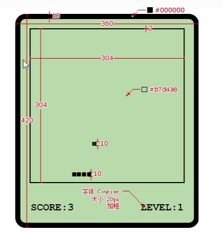

# 🚀贪吃蛇小游戏

使用 TypeScript 语言编写一个贪吃蛇小游戏，效果如下图：



该项目取自尚硅谷的 [TypeScript 教程](https://www.bilibili.com/video/BV1Xy4y1v7S2?p=22&vd_source=9aa6dd2b17385af6671d5759658de6d6)。

# ⚙️如何编译项目？

一、全局安装 Yarn 包管理器

```bash
npm install -g yarn
```

二、拉取该项目，并安装依赖

```bash
yarn install
```

三、打包编译

```bash
npx webpack
```

四、打开`dist/index.html`运行游戏

---